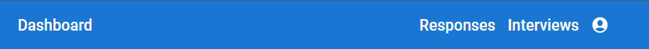
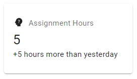
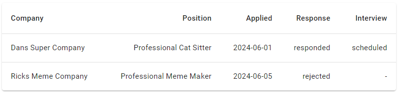
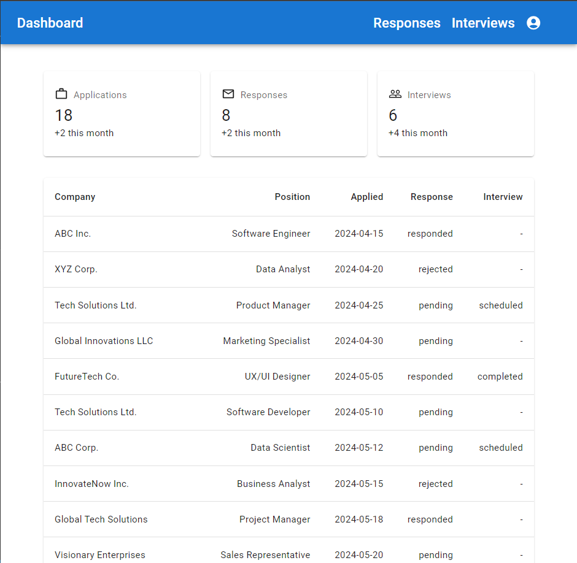
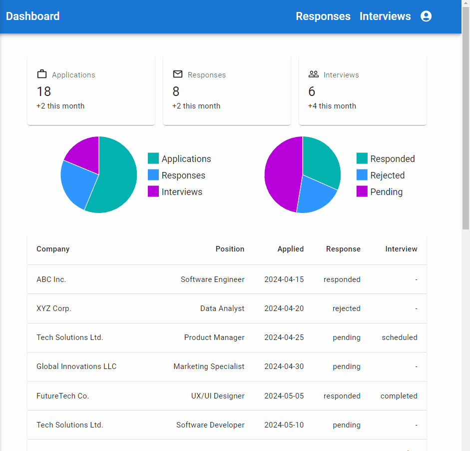

[](https://classroom.github.com/a/NuaiRwSl)
# Assignment 2 - Dashboard User Interface using MUI

This assessment consists of a dashboard user interface that allows users to view their job application data in a dashboard format.

You will be assessed on your knowledge of the following:
- installing MUI
- using MUI components
- creating custom components with different props
- using MUI icons
- layouts with MUI

## Steps

1. Install existing dependencies and the following dependencies below (refer to the documentation to get the project running) and run the dev server to see the existing page.

- MUI (refer to [docs here](https://mui.com/material-ui/getting-started/installation/))
    - install all fonts and icons packages so that you can use the components in your project.
2. Configure MUI in your project so that it uses the Roboto font.

3. In a new directory named `components` at the root of your project, create a new component named `NavBar` with no props. Then import it in the `index.js` file in the `pages` directory. 
- Refer to the [App Bar Documentation](https://mui.com/material-ui/react-app-bar/) to create the NavBar component.
- It should look like the following: <br/>

- Note You'll need to look at the [MUI Icons documentation](https://mui.com/material-ui/material-icons/) to find the correct icons.
4. In your `components` directory, create a component named `DashboardCard` with the following props: `icon`, `title`, `description`, and `subDescription`. Import this component in `index.js`.
- Refer to the [Card Documentation](https://mui.com/material-ui/react-card/) to create the DashboardCard component.
- Note for testing the usage of the component. With the following props:
  - icon: `<PsychologyAltIcon fontSize="small" />`
  - title: "Assignment Hours"
  - description: `5`
  - subDescription: `+5 hours more than yesterday`
- The component should look like the following: <br/>


5. In your `components` directory, create a component named `ApplicationDataTable` with the following prop: `data`. Import this component in `index.js`.
- Refer to the [Table Documentation](https://mui.com/material-ui/react-table/) to use in the `ApplicationDataTable` component.
- Note for testing the usage of the component. With the following prop:
  - data:
```js
[
    {
      "id": 14,
      "company": "Dans Super Company",
      "position": "Professional Cat Sitter",
      "applied": "2024-06-01",
      "response": "responded",
      "interview": "scheduled"
    },
    {
      "id": 15,
      "company": "Ricks Meme Company",
      "position": "Professional Meme Maker",
      "applied": "2024-06-05",
      "response": "rejected",
      "interview": "-"
    }
]
```
- The component should look like the following with the testing data above: <br/>


6. In the `index.js` file, use MUI `Container` and MUI `Grid` components with the data from the `dashboard-data.js` file and your custom components created above (Navbar, DashboardCard, ApplicationDataTable) to create the Dashboard page as shown in the expected output below.
- For the MUI Grid refer to the [Grid Documentation](https://mui.com/material-ui/react-grid/)
- For MUI Container refer to the [Container Documentation](https://mui.com/material-ui/react-container/)

## Expected Output/Functionality
The Dashboard page should look like the following:


## Bonus (only attempt this if you are done with the above steps)
- Create and use a component named `PieDataChart` in the components directory, and use the data from the above to populate the chart so that it looks like below.


## Challenges (only attempt this if you have way too much time on your hands)

- Create a `LineChart` component that will chart by day three lines (from the responses column in your table): the number of responses, the number of rejections, and the number of pending applications.
- Recreate the `ApplicationDataTable` component so that it uses the `DataTable` component of MUI.

## Marking Key

| Marks | Tasks |
|------------------|------------------|
| 3 | Setup the project properly with the correct dependencies and scripts. |
| 1 | Font Properly configured. |
| 3 | `NavBar` component created with the correct props, and uses the proper MUI components and looks like images provided. |
| 5 | `ApplicationDataTable` component created with the correct props, uses the correct MUI components and looks like images provided. |
| 5 | `DashboardCard` component created with the correct props, uses the correct MUI components and looks like images provided. |
| 5 | `index.js` uses custom and MUI components with the correct props to layout and display information on the page like the images provided. |
| -5 | Project runs without errors, and functionality looks like the images provided |
| -3 | Code is clean and well-organized, and components created in the right location |
| 3 (Bonus) | Bonus marks: `PieChartData` component created with the correct props, uses the correct MUI components and looks like images provided.  |

## Marking Rubric
### 5 marks
| Marks | 5 marks Criteria |
|------------------|------------------|
| 5 | Task was completed with the highest of proficiency adhering to best practices and followed subject matter guidelines all tasks were completed to a professional standard. |
| 4 | Task was completed well some minor mistakes. Well above average work shows good understanding of the task and high degree of competence |
| 3  | Satisfactory work some features missing or incorrectly implemented. Show a moderate level of understanding in the task with room for improvement. |
| 2  | Below average work. Task was poorly complete. Show understanding of the task and the requirements to implement but implementation was poorly executed. |
| 1  | Some of the task was completed. Showed a lack of understanding in the subject matter and very poorly executed. |
| 0  | Not completed. |

### 3 marks
| Marks | 3 marks Criteria |
|------------------|------------------|
| 3 | Proficient shows a high degree of competence in completing task. |
| 2 | Capable, above-average degree of competence in completing the task. |
| 1 | Satisfactory shows a satisfactory degree of competence in completing the task. | 
| 0 | Shows a limited degree of competence in completing the task. |
 
### 2 marks

| Marks | 2 marks Criteria |
|------------------|------------------|
| 1 | Task Completed satisfactorily   |
| 0 | Task was not executed. |

### Negative Marks

Negative marks will be given for the assignment at the discretion of the instructor with a maximum of -5 marks for this assignment. The default will be 0 if it is correct.
